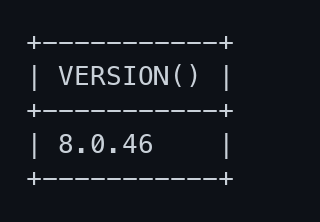
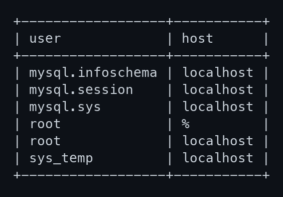
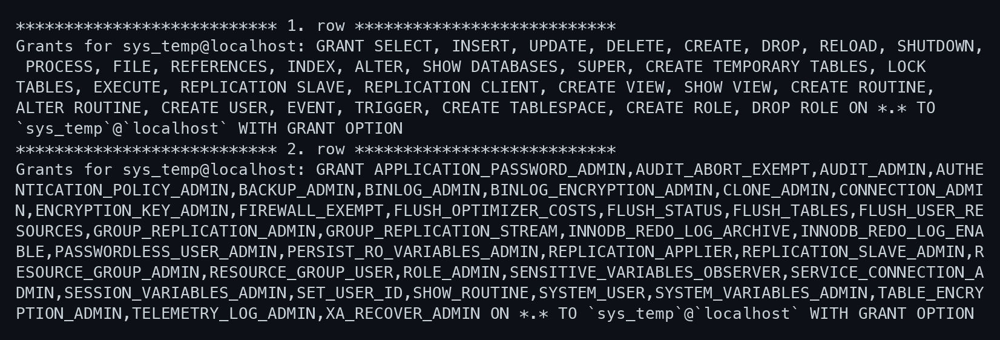
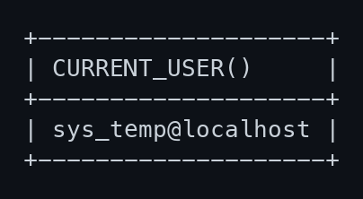
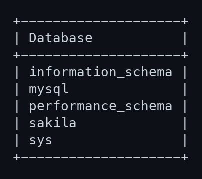
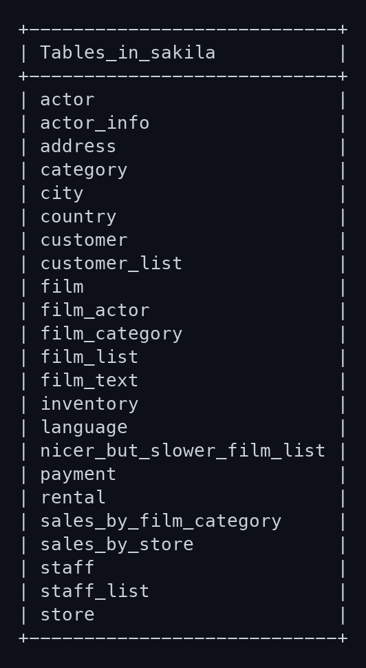
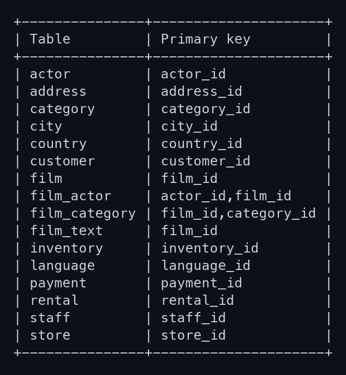

# Работа с данными (DDL/DML)

Домашнее задание к занятию «Работа с данными (DDL/DML)» - Страхов Игорь

> Задание выполнено в командной строке на чистом инстансе MySQL 8.0.46 (Docker).
> Все запросы собраны «простынёй» в конце файла, скриншоты приложены к соответствующим пунктам.

---

## Задание 1

### 1.1. Поднимите чистый инстанс MySQL 8.0+

Проще всего — контейнер Docker (чистый инстанс, ничего не ставится в систему):

```bash
docker run -d \
  --name mysql-hw \
  -e MYSQL_ROOT_PASSWORD=root_pass \
  -p 3306:3306 \
  mysql:8.0

# проверяем, что сервер поднялся
docker exec -it mysql-hw mysql -uroot -proot_pass -e "SELECT VERSION();"
```

Вывод:

```
+-----------+
| VERSION() |
+-----------+
| 8.0.46    |
+-----------+
```

Заходим в консоль MySQL для дальнейшей работы:

```bash
docker exec -it mysql-hw mysql -uroot -proot_pass
```



### 1.2. Создайте учётную запись `sys_temp`

```sql
CREATE USER 'sys_temp'@'localhost' IDENTIFIED BY 'password';
```

Вывод: `Query OK, 0 rows affected`.

### 1.3. Список пользователей в базе данных (скриншот)

```sql
SELECT user, host FROM mysql.user;
```

Вывод (пользователь `sys_temp` присутствует в списке):

```
+------------------+-----------+
| user             | host      |
+------------------+-----------+
| mysql.infoschema | localhost |
| mysql.session    | localhost |
| mysql.sys        | localhost |
| root             | %         |
| root             | localhost |
| sys_temp         | localhost |
+------------------+-----------+
```



### 1.4. Дайте все права для пользователя `sys_temp`

```sql
GRANT ALL PRIVILEGES ON *.* TO 'sys_temp'@'localhost' WITH GRANT OPTION;
FLUSH PRIVILEGES;
```

Вывод: `Query OK, 0 rows affected`.

### 1.5. Список прав для пользователя `sys_temp` (скриншот)

```sql
SHOW GRANTS FOR 'sys_temp'@'localhost'\G
```

Вывод (после `GRANT ALL PRIVILEGES` пользователь получил полный набор статических
и динамических привилегий уровня `*.*` с правом `WITH GRANT OPTION`):



### 1.6. Переподключитесь к базе данных от имени `sys_temp`

Меняем тип аутентификации с `sha2` на `mysql_native_password` (как указано в задании):

```sql
ALTER USER 'sys_temp'@'localhost' IDENTIFIED WITH mysql_native_password BY 'password';
FLUSH PRIVILEGES;
```

Выходим и переподключаемся уже под `sys_temp`:

```bash
docker exec -it mysql-hw mysql -usys_temp -ppassword
```

Проверяем, под кем зашли:

```sql
SELECT CURRENT_USER();
```

Вывод:

```
+--------------------+
| CURRENT_USER()     |
+--------------------+
| sys_temp@localhost |
+--------------------+
```



### 1.7. Скачайте дамп базы данных Sakila

```bash
# скачиваем и распаковываем дамп
curl -L -o sakila-db.zip https://downloads.mysql.com/docs/sakila-db.zip
unzip sakila-db.zip
```

В архиве два файла: `sakila-schema.sql` (структура) и `sakila-data.sql` (данные).

### 1.8. Восстановите дамп в базу данных

Порядок важен: сначала схема, затем данные.

```bash
docker cp sakila-db/sakila-schema.sql mysql-hw:/tmp/
docker cp sakila-db/sakila-data.sql   mysql-hw:/tmp/

docker exec -i mysql-hw mysql -usys_temp -ppassword -e "SOURCE /tmp/sakila-schema.sql;"
docker exec -i mysql-hw mysql -usys_temp -ppassword -e "SOURCE /tmp/sakila-data.sql;"
```

Проверяем, что база появилась:

```sql
SHOW DATABASES;
```

Вывод (среди прочих присутствует `sakila`):

```
+--------------------+
| Database           |
+--------------------+
| information_schema |
| mysql              |
| performance_schema |
| sakila             |
| sys                |
+--------------------+
```



### 1.9. Список всех таблиц восстановленной базы (командная строка) (скриншот)

```sql
USE sakila;
SHOW TABLES;
```

Вывод — 16 базовых таблиц и 7 представлений (views):

```
+----------------------------+
| Tables_in_sakila           |
+----------------------------+
| actor                      |
| actor_info                 |
| address                    |
| category                   |
| city                       |
| country                    |
| customer                   |
| customer_list              |
| film                       |
| film_actor                 |
| film_category              |
| film_list                  |
| film_text                  |
| inventory                  |
| language                   |
| nicer_but_slower_film_list |
| payment                    |
| rental                     |
| sales_by_film_category     |
| sales_by_store             |
| staff                      |
| staff_list                 |
| store                      |
+----------------------------+
```



---

## Простыня со всеми запросами (Задание 1)

```sql
-- 1.1 проверка версии
SELECT VERSION();

-- 1.2 создание пользователя
CREATE USER 'sys_temp'@'localhost' IDENTIFIED BY 'password';

-- 1.3 список пользователей
SELECT user, host FROM mysql.user;

-- 1.4 выдача всех прав
GRANT ALL PRIVILEGES ON *.* TO 'sys_temp'@'localhost' WITH GRANT OPTION;
FLUSH PRIVILEGES;

-- 1.5 список прав пользователя
SHOW GRANTS FOR 'sys_temp'@'localhost';

-- 1.6 смена типа аутентификации и переподключение
ALTER USER 'sys_temp'@'localhost' IDENTIFIED WITH mysql_native_password BY 'password';
FLUSH PRIVILEGES;
SELECT CURRENT_USER();

-- 1.8 восстановление дампа
SOURCE /tmp/sakila-schema.sql;
SOURCE /tmp/sakila-data.sql;
SHOW DATABASES;

-- 1.9 список таблиц
USE sakila;
SHOW TABLES;
```

---

## Задание 2

Таблица восстановленной базы `sakila`: название таблицы и её первичный ключ.
Первичные ключи получены запросом к `information_schema`:

```sql
SELECT TABLE_NAME, COLUMN_NAME
FROM information_schema.KEY_COLUMN_USAGE
WHERE TABLE_SCHEMA = 'sakila'
  AND CONSTRAINT_NAME = 'PRIMARY'
ORDER BY TABLE_NAME, ORDINAL_POSITION;
```

| Название таблицы | Название первичного ключа        |
| ---------------- | -------------------------------- |
| actor            | actor_id                         |
| address          | address_id                       |
| category         | category_id                      |
| city             | city_id                          |
| country          | country_id                       |
| customer         | customer_id                      |
| film             | film_id                          |
| film_actor       | actor_id, film_id (составной)    |
| film_category    | film_id, category_id (составной) |
| film_text        | film_id                          |
| inventory        | inventory_id                     |
| language         | language_id                      |
| payment          | payment_id                       |
| rental           | rental_id                        |
| staff            | staff_id                         |
| store            | store_id                         |

> Представления (views) — `actor_info`, `customer_list`, `film_list`, `nicer_but_slower_film_list`, `sales_by_film_category`, `sales_by_store`, `staff_list` — первичных ключей не имеют и в таблицу не включены.

Первичные ключи, полученные запросом (скриншот реального вывода):


