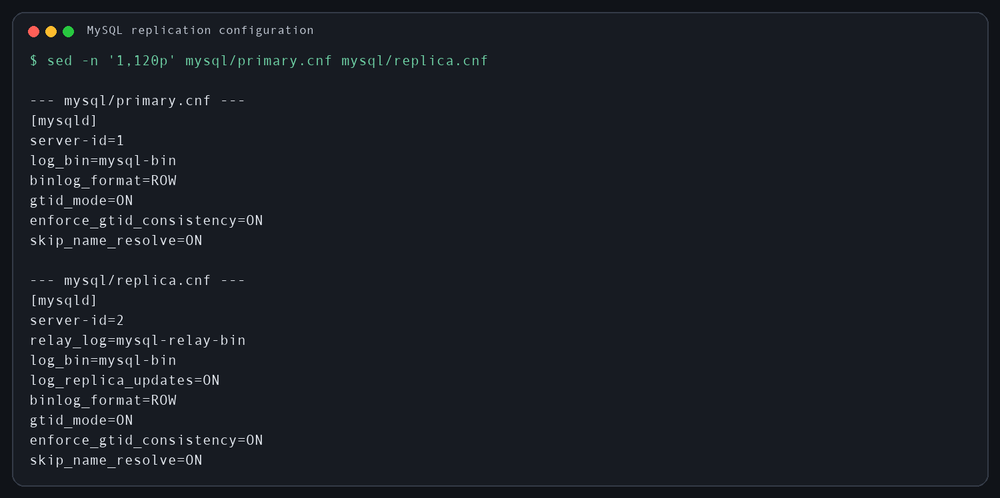
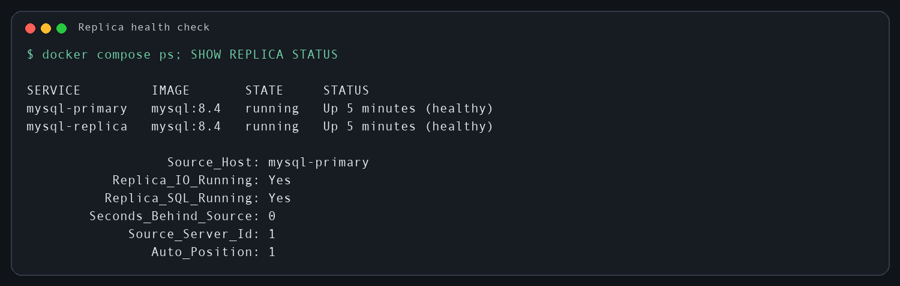
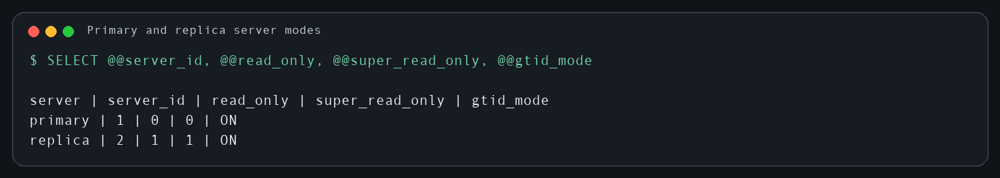
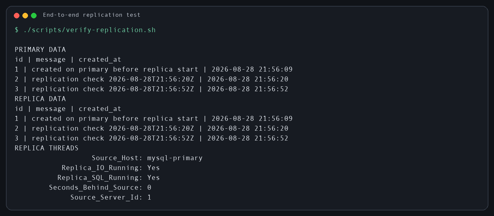

# Репликация и масштабирование. Часть 1

Домашнее задание к занятию «Репликация и масштабирование. Часть 1» — Страхов Игорь

---

## Задание 1

### Различия master-slave и master-master

При репликации **master-slave** запись выполняется только на основном сервере
(`master`), а один или несколько подчинённых серверов (`slave`) получают и
применяют его изменения. Чтение можно распределять между репликами, но запись
остаётся на одном сервере. Такая схема проще в настройке и не создаёт конфликтов
одновременной записи. Её ограничения — возможная задержка репликации и
необходимость переключить роль master при его отказе.

При репликации **master-master** каждый сервер одновременно играет роли master и
slave: оба сервера могут принимать запись и передают изменения друг другу. Это
повышает доступность записи, но сильно усложняет эксплуатацию. Если одинаковые
строки или уникальные ключи изменяются одновременно на разных узлах, возможны
конфликты и рассинхронизация. Кроме того, запись не масштабируется линейно,
поскольку каждое изменение всё равно необходимо применить на всех серверах.

| Характеристика | Master-slave | Master-master |
|---|---|---|
| Серверы, принимающие запись | один master | оба master |
| Масштабирование чтения | да, за счёт slave | да |
| Конфликты записи | практически отсутствуют | возможны |
| Сложность настройки | ниже | выше |
| Типичный сценарий | основной сервер + реплики чтения/резерв | два активных узла с контролем конфликтов |

**Вывод:** для большинства систем безопаснее master-slave. Master-master имеет
смысл только тогда, когда действительно нужна запись на нескольких узлах и
заранее предусмотрено разрешение конфликтов.

---

## Задание 2

Настроена master-slave репликация на двух контейнерах **MySQL 8.4**:

- `mysql-primary` — основной сервер, `server-id=1`, запись бинарного журнала и
  GTID включены;
- `mysql-replica` — реплика, `server-id=2`, включены `read_only` и
  `super_read_only`.

### Структура решения

```text
12-05-replication-scaling-part-1/
├── docker-compose.yml
├── mysql/
│   ├── init-primary.sql
│   ├── primary.cnf
│   └── replica.cnf
├── scripts/
│   ├── setup-replication.sh
│   └── verify-replication.sh
├── img/
└── README.md
```

### Конфигурация серверов

На master включены бинарный журнал, построчный формат событий и GTID:

```ini
[mysqld]
server-id=1
log_bin=mysql-bin
binlog_format=ROW
gtid_mode=ON
enforce_gtid_consistency=ON
```

На slave задан отдельный `server-id`, relay log и сохранение применённых
событий в собственный binlog:

```ini
[mysqld]
server-id=2
relay_log=mysql-relay-bin
log_bin=mysql-bin
log_replica_updates=ON
binlog_format=ROW
gtid_mode=ON
enforce_gtid_consistency=ON
```



### Запуск и настройка репликации

```bash
chmod +x scripts/*.sh
./scripts/setup-replication.sh
```

Скрипт запускает оба сервера, ожидает их готовность, подключает slave к master с
помощью GTID и переводит реплику в режим только для чтения. Основные команды:

```sql
CHANGE REPLICATION SOURCE TO
  SOURCE_HOST='mysql-primary',
  SOURCE_PORT=3306,
  SOURCE_USER='repl',
  SOURCE_PASSWORD='replica_password',
  SOURCE_AUTO_POSITION=1,
  GET_SOURCE_PUBLIC_KEY=1;
START REPLICA;
SET GLOBAL read_only=ON;
SET GLOBAL super_read_only=ON;
```

### Состояние и режимы работы серверов

Проверка `SHOW REPLICA STATUS\G` показала:

```text
Source_Host: mysql-primary
Replica_IO_Running: Yes
Replica_SQL_Running: Yes
Seconds_Behind_Source: 0
Source_Server_Id: 1
Auto_Position: 1
```

Оба потока репликации работают, ошибок нет, отставание slave от master равно
нулю. Реплика принимает изменения автоматически по GTID.



Режимы серверов дополнительно проверяются командами:

```sql
-- master
SELECT @@server_id, @@read_only, @@super_read_only, @@gtid_mode;

-- slave
SELECT @@server_id, @@read_only, @@super_read_only, @@gtid_mode;
```

Ожидаемый результат: master имеет `server_id=1` и доступен для записи; slave
имеет `server_id=2`, `read_only=1`, `super_read_only=1`.



### Проверка передачи данных

```bash
./scripts/verify-replication.sh
```

Скрипт добавляет новую строку в таблицу `replication_check` на master, затем
читает таблицу на обоих серверах. Одинаковый набор строк на master и slave
подтверждает, что репликация работает не только по статусу, но и фактически.



### Остановка стенда

```bash
docker compose down

# при необходимости удалить также тестовые данные
docker compose down -v
```

**Итог:** master-slave репликация настроена и проверена. Серверы работают в
ожидаемых режимах, оба потока репликации имеют статус `Yes`, отставание равно
нулю, тестовая запись с master появилась на slave.
