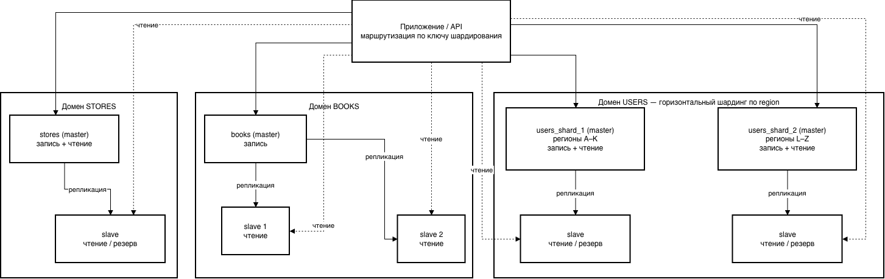

# Репликация и масштабирование. Часть 2

Домашнее задание к занятию «Репликация и масштабирование. Часть 2» - Страхов Игорь

---

## Задание 1

Опишите основные преимущества использования масштабирования методами:

### Активный master-сервер и пассивный репликационный slave-сервер (active/passive)

Схема: один master принимает все запросы (чтение и запись), slave в фоне
получает копию данных по репликации и в обычном режиме нагрузку не обслуживает —
находится в «горячем резерве».

Основные преимущества:

- **Отказоустойчивость (HA).** При выходе master из строя можно быстро
  переключить нагрузку на slave (failover), потеряв минимум данных или не потеряв
  их вовсе. Простой сервиса сокращается с часов до секунд/минут.
- **Резервное копирование без нагрузки на боевой сервер.** Бэкапы можно снимать
  со slave — тяжёлые операции `dump`/`backup` не тормозят production-master.
- **Защита от аппаратного сбоя.** Всегда есть актуальная физическая копия базы на
  отдельном сервере (а лучше — в другой стойке/ЦОД).
- **Простота.** Нет проблемы конфликтов записи: пишет только один узел, поэтому
  не нужно решать, чья версия строки «правильная».
- **Тестирование и аналитика.** На пассивной копии можно прогонять тяжёлые
  аналитические запросы, не мешая основной нагрузке.

Минусы: ресурсы slave простаивают (он не разгружает чтение), масштабируется
только «вверх» (вертикально).

### Master-сервер и несколько slave-серверов (1 master + N slave)

Схема: один master обслуживает все операции записи, несколько slave реплицируют
данные и обслуживают запросы на чтение.

Основные преимущества:

- **Горизонтальное масштабирование чтения.** Запросы `SELECT` распределяются
  между несколькими slave (через балансировщик/прокси, например ProxySQL,
  HAProxy). Чем больше slave — тем больше суммарная пропускная способность на
  чтение. Это ключевое преимущество для систем, где чтений в разы больше, чем
  записей (типовой веб-проект).
- **Повышенная отказоустойчивость.** Отказ одного slave не влияет на работу — его
  просто исключают из пула; любой slave можно повысить до нового master.
- **Географическое распределение.** Slave можно размещать ближе к пользователям
  (в разных регионах), снижая задержку чтения.
- **Гибкое разделение нагрузки.** Разные slave можно выделить под разные задачи:
  один под отчёты/аналитику, другие — под пользовательские чтения, ещё один — под
  бэкапы.

Минусы: запись по-прежнему упирается в единственный master (он не масштабируется
этим методом); есть задержка репликации (replication lag) — slave может отдавать
слегка устаревшие данные (eventual consistency).

---

## Задание 2

Разработайте план для выполнения **горизонтального** и **вертикального** шардинга
базы данных из трёх таблиц: **пользователи (users)**, **книги (books)**,
**магазины (stores)**.

### Исходные таблицы (столбцы произвольно)

| users            | books             | stores            |
| ---------------- | ----------------- | ----------------- |
| user_id (PK)     | book_id (PK)      | store_id (PK)     |
| name             | title             | name              |
| email            | author            | address           |
| region           | genre             | region            |
| registered_at    | store_id (FK)     | phone             |

### Принцип разбиения

**Вертикальный шардинг (по таблицам / доменам).** Разные таблицы (домены данных)
выносятся на разные серверы БД. Логически несвязанные сущности разделяются по
функциональному признаку:

- **Shard A — Users** — сервис пользователей (регистрация, профили).
- **Shard B — Books** — каталог книг.
- **Shard C — Stores** — справочник магазинов.

Плюс: каждый сервер занимается своей предметной областью, его можно независимо
масштабировать и обслуживать. Минус: `JOIN` между таблицами разных шардов
делается на уровне приложения, а не в БД.

**Горизонтальный шардинг (шардинг строк).** Самая крупная и быстрорастущая
таблица — **users** — дополнительно разбивается на несколько серверов по значению
**ключа шардирования**. Здесь ключ — `region` (можно и хэш от `user_id` для
равномерного распределения):

- **users_shard_1** — пользователи региона «Запад» (регионы A–K);
- **users_shard_2** — пользователи региона «Восток» (регионы L–Z).

Строки одной таблицы физически лежат на разных серверах; приложение по ключу
шардирования знает, к какому серверу обращаться.

Аналогично при росте можно горизонтально шардировать `books` — например, по
`genre` или по хэшу `book_id`.

### Блок-схема размещения

### Режимы работы серверов

| Сервер                    | Роль            | Режим работы                                     |
| ------------------------- | --------------- | ------------------------------------------------ |
| users_shard_1 (master)    | master          | чтение + запись (пользователи регионов A–K)       |
| users_shard_1 slave       | slave           | только чтение + горячий резерв/бэкапы             |
| users_shard_2 (master)    | master          | чтение + запись (пользователи регионов L–Z)       |
| users_shard_2 slave       | slave           | только чтение + горячий резерв/бэкапы             |
| books (master)            | master          | запись каталога книг                             |
| books slave 1, slave 2    | slave           | только чтение (каталог читается часто)            |
| stores (master)           | master          | чтение + запись справочника магазинов            |
| stores slave              | slave           | только чтение + горячий резерв                    |

**Итог:** вертикальный шардинг разносит домены `users` / `books` / `stores` по
отдельным серверам; горизонтальный шардинг дополнительно делит самый нагруженный
домен `users` по `region` на два master-шарда. Внутри каждого домена работает
репликация master → slave: master обслуживает запись (и часть чтения), slave —
масштабируют чтение и выступают горячим резервом для отказоустойчивости.
